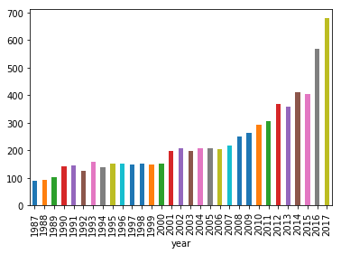
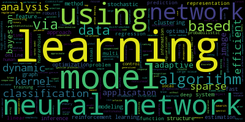
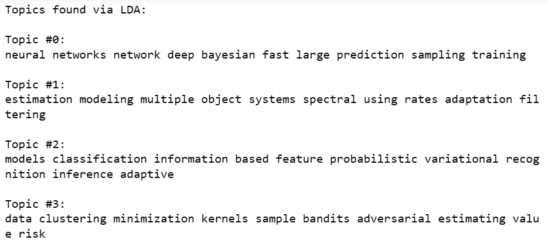

# Sentiment-Analysis

An introductory project to natural language processing from data camp providing the building blocks for natural language processing. This repository also contains a feasibility study carried out for MT414 assessing the requirements needed to conduct sentiment analysis using posts from Twitter.

Skills Showcased:

-   Machine Learning - Natural Language Processing
-   Data Cleaning
-   Data Analysis

[View more projects like this!](https://cian-murray-doyle.github.io/)

## Libraries Overview

The following Python libraries will be used for this project.

``` python
import pandas as pd
import matplotlib.pyplot
import re
import wordcloud
from sklearn.feature_extraction.text import CountVectorizer
import numpy as np
import warnings
from sklearn.decomposition import LatentDirichletAllocation as LDA
```

## Preparing Data

In our data we can see that there are columns of data that contain irrelevant text such as ID, event_type, and pdf_name. As we want to analyse text we will remove these columns from our data set.

To understand the recent boom in machine learning, we can analyse the number of papers published over time line in the data.



Next we will analyse the titles of these reports to understand any trends in machine learning in academia. To analyse the titles we need to process the text, removing any punctuation and converting the strings to lowercase characters.

To verify that our processing has worked correctly we can create a word cloud using the titles of the papers. The word cloud represents how often a word shows up in the title of the papers.



Next we will use latent Dirichlet allocation to detect the topic of the papers. LDA defines topics as a set of words to co-occur together often. To use LDA we need to convert our data into a list of vectors. Once we convert our data to vectors we can then find and plot the 10 most common words.


We can now apply our LDA model to analyse the paper titles and find the related topics. We can play around with the number of topics until the lowest perplexity is found. In our case we settled on 10 topics.


